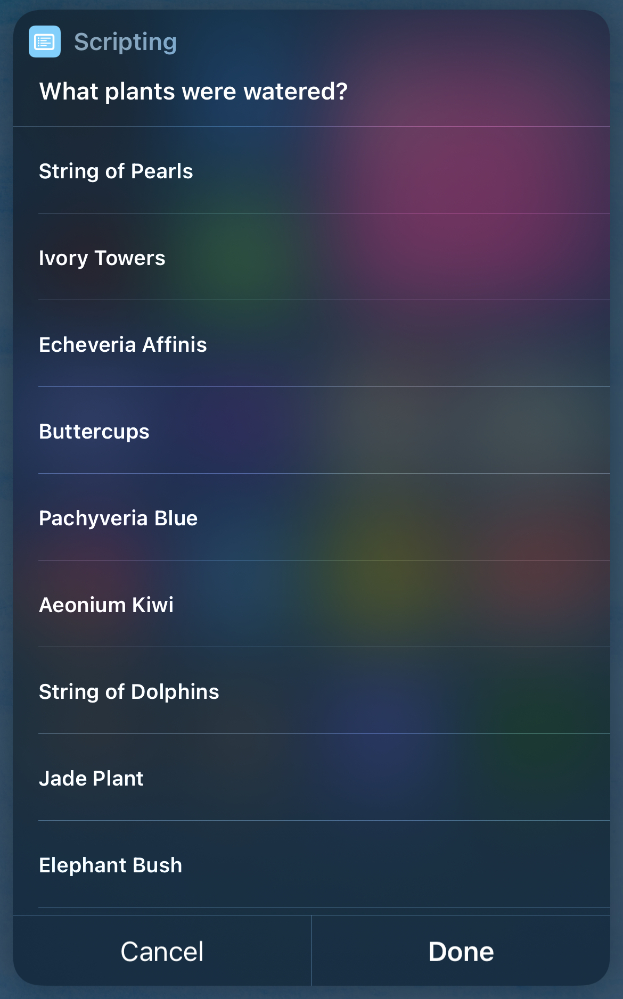
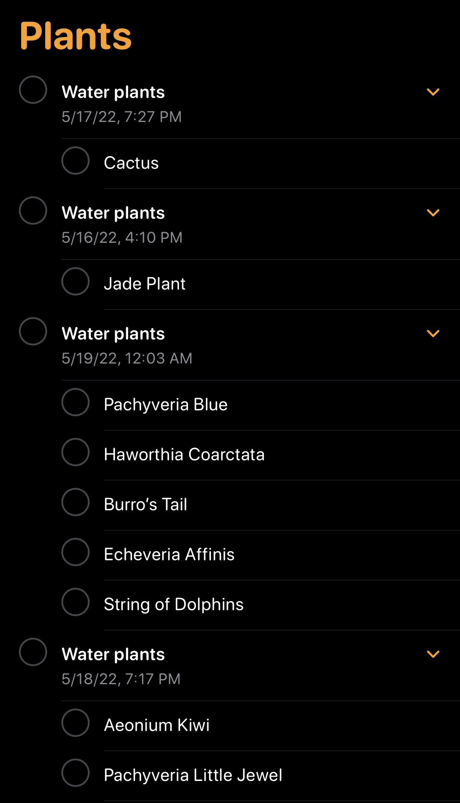

# notion-plant-tracker
 
An express.js app running on a Raspberry Pi to keep track of watered plants using the notion API

The app receives requests from an Apple shortcuts when then sends a list of plants back which the user selects that have been watered. 

### [Notion Plant Tracker Page](https://unequaled-diploma-a0e.notion.site/Plant-Tracker-469ee40e380842778645c2aeb8d22df9)

### [Apple Shortcut Script](https://www.icloud.com/shortcuts/8c09ee08ffb14c599e735d7fb652a1a0)

If unable to view the script check the [screenshots](/assets/script-screenshots/)

## Endpoints

## `/plants`

**GET** 

a JSON object containng a map of my plants which the shortcuts will use to ask the user to select which plants watered. The IDs are used to send a POST request for watered plants.

```json
{
  "Buttercups": "<ID>",
  "Elephant Bush": "<ID>",
  "String of Dolphins": "<ID>",
}
```



## `/plants/schedule/:ids`

**GET** 

a JSON object containing a key value pair of # of day -> array of plants. It is in this format because it is easier to consume on apple shortcuts. It is then used to set remainders on my phone for the next time to water it.

```json
{
  "3": [
    "Buttercups"
  ],
  "10": [
    "Elephant Bush"
  ],
  "15": [
    "String of Pearls"
  ]
}
```



## `/water-plants/:ids`

**POST** 

based on the selected plants, the shortcut sends a POST request to the server to update when these plants were watered.


## Functionality

Because relative dates arehuman readible, and easier to guage how long it has been since a plant has been last watered I included them. But that means I needed to upate the front page everyday so the dates make sense and here is an example of it running using node-cron.


Due to the limitations of the Notion API I have to make a request for every 'block' I want to delete. I decided to use bottleneck.js to make sure I am only sending a max of 3 requests per second to abide by the limit. Since some tasks may take longer I made sure to only have one one concurrent limiter.

